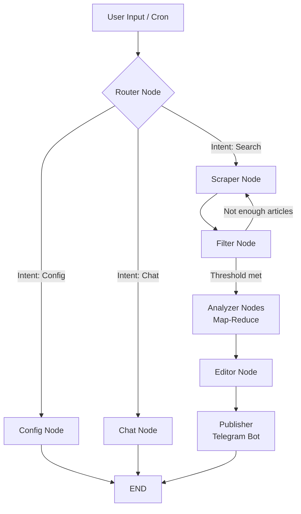

# Personal Research Agent 🤖

An autonomous, multi-agent workflow built with **LangGraph** that proactively scrapes, filters, analyzes, and synthesizes high-quality knowledge from the internet. Deployed as a 24/7 Telegram Bot with long-term memory and Dockerized infrastructure.

## 🌟 Key Features

- **Agentic Workflow Topology:** Utilizes LangGraph to manage complex cyclical state routing instead of traditional linear chains.
- **Dynamic Intent Routing:** Semantic routing mechanism that intelligently classifies user messages into `Search`, `Config`, or casual `Chat` operations.
- **Intelligent Noise Filtering:** Employs an LLM gatekeeper to evaluate meta-descriptions, dropping clickbait and irrelevant links to reduce API token costs by ~70%.
- **Map-Reduce Parallel Analysis:** Dispatches multiple sub-agents simultaneously to read and extract core insights from different sources, drastically cutting down processing latency.
- **Long-term Memory (Persistence):** Integrates **PostgreSQL** (`PostgresSaver`) to permanently store conversational history and user configuration preferences (Followed/Blocked topics, Languages).
- **Production-Ready Infrastructure:** Fully containerized using **Docker & Docker Compose**, designed to run autonomously 24/7 on cloud servers (AWS/GCP/DigitalOcean) with automated daily cron jobs.

## 🛠️ Technology Stack

| Category | Technologies |
|---|---|
| **Core Framework** | LangGraph, LangChain |
| **Large Language Models** | Google Gemini (2.5 Flash Lite) |
| **Search Engine** | Tavily Search API |
| **Persistence (Database)** | PostgreSQL, psycopg-pool |
| **Bot Interface** | Python Telegram Bot |
| **DevOps & Infra** | Docker, Docker Compose |

## 🏗️ Architecture & Graph Topology

The agent operates on a cyclical state graph defined below:



## 📁 Production Folder Structure

```text
personal-research-agent/
├── .env.example              # Environment variables template
├── Dockerfile                # Container blueprint
├── docker-compose.yml        # Multi-container orchestration (Bot + PostgreSQL)
├── requirements.txt          # Python dependencies
└── src/
    ├── main.py               # LangGraph compilation and execution
    ├── graph/
    │   ├── state.py          # TypedDict AgentState definition
    │   ├── nodes.py          # Core logic (Scraper, Filter, Analyzer...)
    │   ├── edges.py          # Conditional branching logic
    │   └── router.py         # Semantic Intent Classification
    ├── prompt/
    │   ├── router_prompt.txt # Prompt templates
    │   └── ...
    └── utils/
        └── telegram_bot.py   # Async Telegram interface & Cron scheduling
```

## 🚀 Quick Start (Local & Cloud Deployment)

**1. Clone the repository:**
```bash
git clone https://github.com/Tan-1106/Personal-Research-Agent.git
cd Personal-Research-Agent
```

**2. Configure Environment Variables:**
Create a `.env` file based on `.env.example`:
```env
# API Keys
GOOGLE_API_KEY=your_gemini_api_key
TAVILY_API_KEY=your_tavily_api_key
TELEGRAM_BOT_TOKEN=your_telegram_bot_token

# Admin ID for Daily Cron Digest
TELEGRAM_ADMIN_ID=your_chat_id
TIMEZONE=Asia/Ho_Chi_Minh

# Database (Automatically mapped in docker-compose)
DATABASE_URI=postgresql://agent_user:agent_password@db:5432/agent_db
```

**3. Spin up the containers:**
```bash
sudo docker-compose up --build -d
```

The bot will automatically initialize the database, compile the LangGraph workflow, and start listening for your messages on Telegram.
